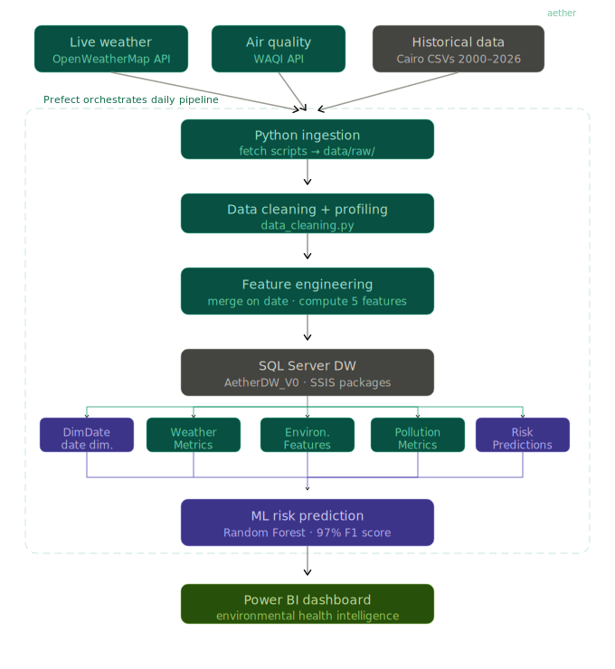

<div align="center">



<br/>
<br/>

[](https://github.com/username/aether/actions)
[](https://codecov.io/gh/username/aether)
[](https://python.org)
[](https://www.microsoft.com/sql-server)
[](https://scikit-learn.org)
[](LICENSE)

<br/>

**Predicting environmental health risks in Cairo through data engineering and machine learning**

[Overview](#-overview) · [Architecture](#-architecture) · [Quick Start](#-quick-start) · [ML Model](#-ml-model) · [Dashboard](#-dashboard) · [Contributing](#-contributing)

</div>

---

## Overview

Aether is a production-grade environmental health intelligence platform built for Cairo, Egypt. It ingests real-time weather and air quality data from live APIs, processes it through an automated ETL pipeline, and applies a trained Random Forest classifier to generate daily health risk predictions — delivering actionable insights to residents through an interactive Power BI dashboard.

The platform was built to address a genuine public health gap: Cairo consistently ranks among the world's most polluted cities, yet there is no unified, automated system that translates raw environmental data into clear, daily health guidance.

```
📡 Live APIs → 🔧 ETL Pipeline → 🗄️ SQL Server DW → 🤖 ML Model → 📊 Power BI
                    (Prefect orchestrates every step, daily)
```

**Key outcomes:**
- Classifies each day into one of 5 health risk categories with 97% F1 score
- Tracks 13 environmental features across weather and pollution dimensions
- Covers 1,154 days of historical data (2022–2025) for trend analysis
- Fully automated — runs daily with zero manual intervention

---

## Architecture

<div align="center">

</div>

<br/>

The platform is organised into four clearly separated layers:

**Ingestion layer** — Two Python scripts pull from OpenWeatherMap (weather) and WAQI (air quality, station A527650 Cairo). Historical backfill CSVs cover 2000–2026.

**Processing layer** — `data_cleaning.py` applies targeted null handling (median fill on non-critical columns, drop only when critical fields are missing). `feature_engineering.py` inner-joins weather and pollution on `date` and derives five composite health features.

**Storage layer** — SSIS packages load `environmental_features.csv` into SQL Server (`AetherDW_V0`) with five tables. A lookup transformation prevents duplicate loads.

**Intelligence layer** — A Random Forest classifier runs inference on the latest features and writes predictions to `RiskPredictions`. Power BI connects directly to the DW for live reporting.

---

## Project structure

```
Aether_V0/
├── Automation/
│   └── prefect_pipeline.py          # Daily orchestration (Prefect)
├── Dashboard/
│   └── Aether_V0_Dashboard.pbix     # Power BI report file
├── data/
│   ├── raw/                         # API JSON outputs
│   ├── staging/                     # Cleaned CSVs
│   └── processed/
│       └── environmental_features.csv
├── Database/
│   └── DDL.sql                      # Full DW schema
├── ML/
│   ├── training/train_risk_model.py
│   ├── inference/predict_risk.py
│   └── models/environmental_risk_model.pkl
├── pipelines/
│   ├── ingestion/
│   │   ├── fetch_weather_api.py
│   │   └── fetch_pollution_api.py
│   ├── loading/
│   │   └── load_to_sql.py
│   └── transformation/
│       ├── data_cleaning.py
│       └── feature_engineering.py
├── ssis/
│   └── LoadEnvironmentalFeatures.dtsx
├── utils/
│   ├── __init__.py
│   └── logger.py
└── logs/
    └── pipeline.log
```

---

## Quick start

### Prerequisites

| Tool | Version | Notes |
|---|---|---|
| Python | 3.9+ | Tested on 3.11 |
| SQL Server | 2019+ | Named instance required |
| SSIS | Visual Studio 2022 | Integration Services extension |
| Power BI Desktop | Latest | For dashboard file |

### Installation

**1. Clone the repository**

```bash
git clone https://github.com/username/aether.git
cd aether
```

**2. Create virtual environment**

```bash
python -m venv venv
# Windows
venv\Scripts\activate
# macOS / Linux
source venv/bin/activate
```

**3. Install dependencies**

```bash
pip install -r requirements.txt
```

**4. Configure credentials**

Copy `.env.example` to `.env` and fill in your values:

```env
# API keys
OPENWEATHER_API_KEY=your_key_here
WAQI_TOKEN=your_token_here

# SQL Server
SQL_SERVER=DESKTOP-XXXXXXX          # your named instance
SQL_DATABASE=AetherDW_V0

# Paths
PROJECT_ROOT=D:\Aether\Aether_V0
DTEXEC_PATH=C:\Program Files\Microsoft SQL Server\160\DTS\Binn\dtexec.exe
```

**5. Initialise the database**

```sql
-- Run Database/DDL.sql against your SQL Server instance
-- Creates: DimDate, WeatherMetrics, PollutionMetrics,
--          EnvironmentalFeatures, RiskPredictions
```

**6. Load historical data**

```bash
python pipelines/transformation/data_cleaning.py
python pipelines/transformation/feature_engineering.py --historical
```

**7. Train the model**

```bash
python ML/training/train_risk_model.py
# Outputs: ML/models/environmental_risk_model.pkl
```

**8. Run the full pipeline**

```bash
# Single run
python Automation/prefect_pipeline.py

# Or run each step manually
python pipelines/ingestion/fetch_weather_api.py
python pipelines/ingestion/fetch_pollution_api.py
python pipelines/transformation/feature_engineering.py
# then execute the SSIS package via dtexec
python ML/inference/predict_risk.py
```

---

## Data sources

| Layer | Source | Coverage | Format |
|---|---|---|---|
| Live weather | OpenWeatherMap API | Real-time Cairo | JSON |
| Live air quality | WAQI API (station A527650) | Real-time Cairo | JSON |
| Historical weather | Open-Meteo / Kaggle | 2000–2025 | CSV |
| Historical air quality | Open-Meteo / Kaggle | 2022–2026 | CSV |

**After inner join on date:** 1,154 overlapping rows spanning 2022–2025 used for training and historical analysis.

**Key columns after cleaning:**

| Feature | Source | Description |
|---|---|---|
| `temperature` | Weather | Mean daily temperature (°C) |
| `humidity` | Weather | Relative humidity (%) |
| `wind` | Weather | Wind speed (km/h) |
| `pressure` | Weather | Mean sea-level pressure (hPa) |
| `pm25` | Pollution | PM2.5 concentration (μg/m³) |
| `pm10` | Pollution | PM10 concentration (μg/m³) |
| `aqi` | Pollution | US AQI index |
| `european_aqi` | Pollution | European AQI index |
| `ozone` | Pollution | Ozone (μg/m³) |
| `nitrogen_dioxide` | Pollution | NO₂ (μg/m³) |

---

## Engineered features

Five composite features are derived during `feature_engineering.py` to capture health-relevant interactions:

```python
heat_index        = temperature + (0.33 × humidity) - (0.70 × wind)
pollution_level   = (pm25 × 0.5) + (pm10 × 0.3) + (aqi × 0.2)
respiratory_stress= (pm25 × 0.4) + (ozone × 0.3) + (no2 × 0.2) + (so2 × 0.1)
uv_risk           = clip((uv_index / 11) × 100, 0, 100)
health_category   = classify_health(row)   # rule-based label → ML target
```

---

## ML model

### Training

```
Algorithm    Random Forest Classifier
Estimators   200 trees
Max depth    15
Class weight balanced   (critical for Cairo's skewed distribution)
Train split  80 / 20 stratified
```

### Performance

| Metric | Score |
|---|---|
| Overall accuracy | **97%** |
| Weighted F1 | **0.97** |
| All-class precision | >90% |
| All-class recall | >90% |

### Feature importance

| Rank | Feature | Importance |
|---|---|---|
| 1 | `aqi` | 31% |
| 2 | `pm25` | 21% |
| 3 | `pollution_level` | 14% |
| 4 | `respiratory_stress` | 11% |
| 5 | `heat_index` | 9% |

### Health categories

The model classifies each day into one of five categories, calibrated specifically for Cairo's pollution baseline:

| Category | Threshold | Days | Advice |
|---|---|---|---|
| 🟢 Safe Air Day | AQI ≤ 55, PM2.5 ≤ 14 | 52 (5%) | Enjoy outdoor activity |
| 🟡 Moderate Risk Day | AQI ≤ 70, PM2.5 ≤ 20 | 353 (31%) | Sensitive groups take care |
| 🟠 High Respiratory Risk Day | AQI ≤ 85, PM2.5 ≤ 30 | 556 (48%) | Limit prolonged outdoor exertion |
| 🔴 Mask Recommended Day | AQI ≤ 110, PM2.5 ≤ 50 | 150 (13%) | Wear N95 outdoors |
| ⛔ Avoid Outdoor Activity Day | AQI > 110, PM2.5 > 50 | 43 (4%) | Stay indoors |

> **Note:** Thresholds are deliberately lower than WHO global guidelines because Cairo's baseline pollution is consistently elevated. A "safe" day in Cairo corresponds roughly to AQI 40–55, not the global threshold of 0–50.

---

## Orchestration

The full pipeline runs daily via **Prefect**, executing these tasks in sequence:

```
fetch_weather  →  fetch_pollution  →  feature_engineering  →  load_ssis  →  run_predictions
```

Each task is configured with `retries=2` and `retry_delay_seconds=10`. All steps write to `logs/pipeline.log`.

```python
# To trigger a manual run:
python Automation/prefect_pipeline.py
```

---

## Database schema

```
AetherDW_V0
├── DimDate                  # date dimension (date_id, year, month, quarter, is_weekend)
├── WeatherMetrics           # raw daily weather (temperature, humidity, wind, pressure…)
├── PollutionMetrics         # raw daily pollution (pm25, pm10, aqi, ozone, no2, so2…)
├── EnvironmentalFeatures    # joined + engineered (main analytics table)
└── RiskPredictions          # ML output (health_category, model_version, predicted_at)
```

Power BI connects directly to `EnvironmentalFeatures` and `RiskPredictions` joined through `DimDate`.

---

## Dashboard

The Power BI dashboard (`Dashboard/Aether_V0_Dashboard.pbix`) has two pages:

**Page 1 — Environmental overview**
- KPI cards: Total Days, Average AQI, Average Heat Index, Dangerous Days Rate, Latest Status
- AQI + PM2.5 trend line chart (by month)
- Heat Index trend by month
- AQI distribution by month (column chart)
- Health category breakdown (donut chart)
- Temperature vs PM2.5 scatter (by health category)
- Date range slicer

**Page 2 — Health intelligence**
- Today's health status card
- Monthly health category distribution (stacked bar)
- Pollution level vs Respiratory Stress scatter
- Prediction history table (sortable by date)
- Month × Year AQI heatmap matrix

---

## Environment variables reference

```env
OPENWEATHER_API_KEY   # OpenWeatherMap API key
WAQI_TOKEN            # WAQI API token (station A527650)
SQL_SERVER            # SQL Server named instance (e.g. DESKTOP-Q5KEU1E)
SQL_DATABASE          # AetherDW_V0
SQL_DRIVER            # ODBC Driver 17 for SQL Server
PROJECT_ROOT          # Absolute path to Aether_V0 folder
DTEXEC_PATH           # Path to dtexec.exe for SSIS execution
```

---

## Tech stack

| Layer | Technology |
|---|---|
| Language | Python 3.11 |
| ETL / transformation | pandas, numpy |
| Machine learning | scikit-learn (RandomForestClassifier) |
| Database | SQL Server 2019, pyodbc |
| SSIS | SQL Server Integration Services 2022 |
| Orchestration | Prefect 2 |
| Dashboard | Power BI Desktop |
| Logging | Python `logging` + custom utils/logger.py |
| Environment | python-dotenv |

---

## Contributing

Contributions are welcome. Please open an issue first to discuss any significant change.

```bash
# Fork → branch → commit → pull request
git checkout -b feature/your-feature-name
git commit -m "feat: describe your change"
git push origin feature/your-feature-name
```

Code style: `black` + `flake8`. Run `pre-commit install` after cloning.

---

## License

MIT — see [LICENSE](LICENSE) for details.

---

<div align="center">
<sub>Built for Cairo · Data Engineering + Machine Learning · 2025</sub>
</div>
