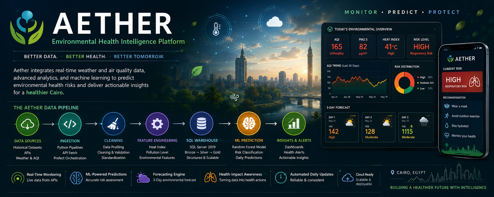
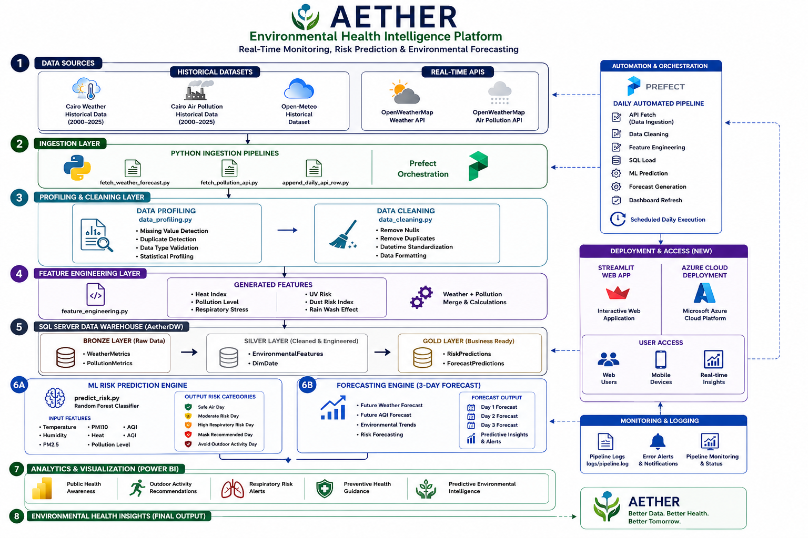
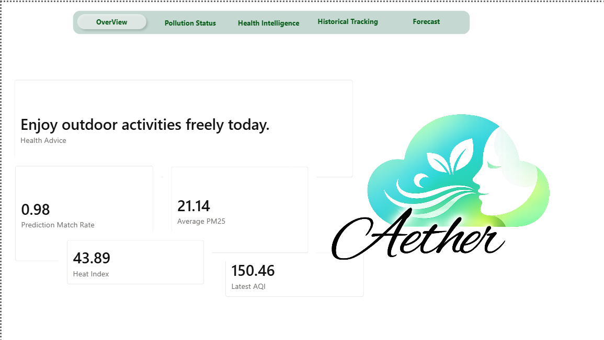
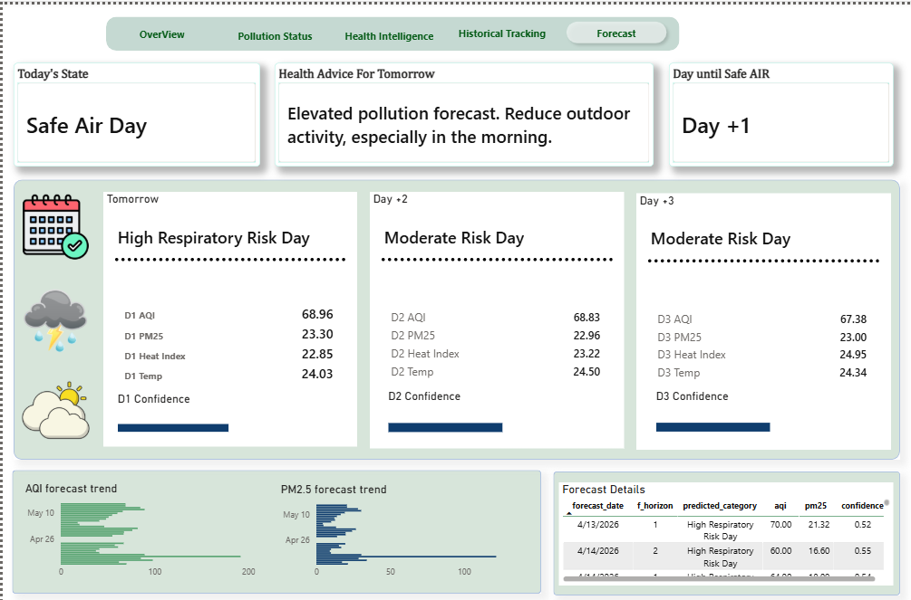
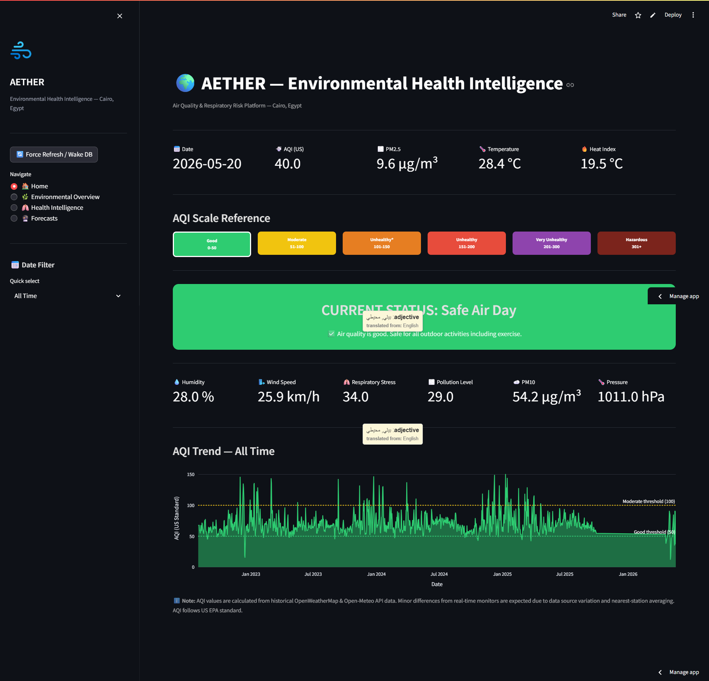
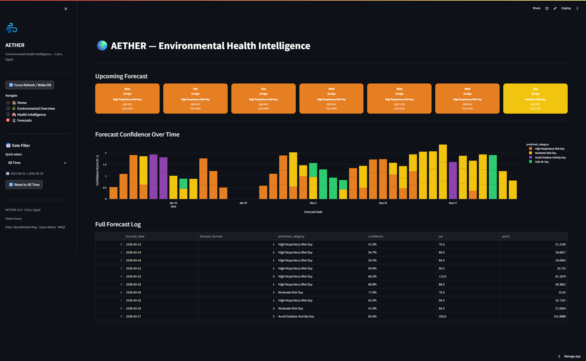
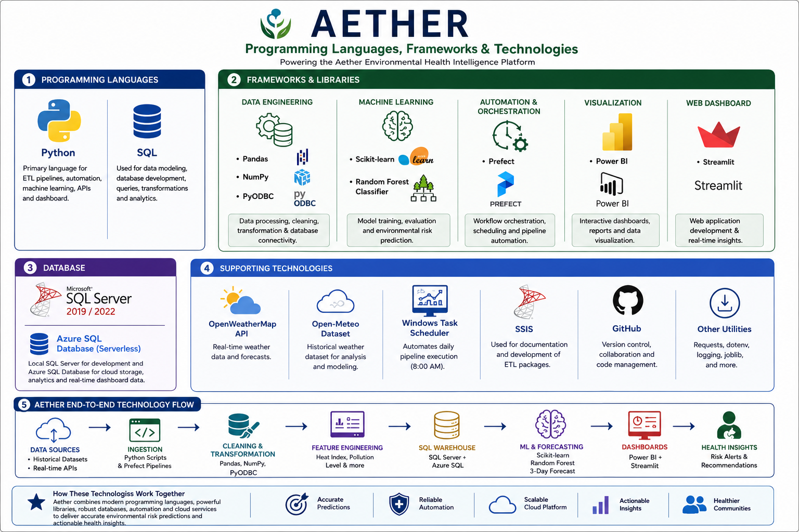

<div align="center">

<!-- Replace with your actual banner image -->


<br/>
<br/>


<br/>

**Daily environmental health risk intelligence for Cairo, Egypt**  
*Automated ETL · Random Forest ML · 3-Day Forecasting · Live Web Dashboard*

<br/>

[Overview](#-overview) · [Architecture](#-architecture) · [Quick Start](#-quick-start) · [ML Model](#-ml-model) · [Dashboard](#-dashboard) · [Streamlit App](#-streamlit-app) · [Azure Deployment](#-azure-deployment)

</div>

---

## 🌍 Live Application

<div align="center">

### 🔗 [aether-cairo.streamlit.app](https://aether-cairo.streamlit.app)

*Hosted on Streamlit Community Cloud · Backed by Azure SQL Database*

</div>

> **First visit note:** Azure SQL free tier pauses after 60 minutes of inactivity. If the app shows a loading message, wait 30 seconds and click **Refresh Data** in the sidebar. Subsequent loads are instant.

---

## Overview

Aether is a production-grade environmental health intelligence platform for Cairo, Egypt. It ingests real-time weather and air quality data from live APIs, processes it through an automated daily ETL pipeline, and applies a trained Random Forest classifier to classify each day into one of five health risk categories — delivering actionable guidance through both a live Streamlit web application and a Power BI dashboard.

**The problem it solves:** Cairo consistently ranks among the world's most polluted cities, yet no unified, automated system translates raw environmental measurements into clear daily health guidance for residents.

```
📡 Live APIs  →  🔧 ETL Pipeline  →  🗄️ Medallion DWH  →  🤖 ML Model  →  📊 Dashboard + 🌐 Web App
                       (Prefect orchestrates every step, daily at 07:00)
```

**Key outcomes:**
- Classifies each day into one of **5 health risk categories** with **94% overall accuracy**
- Tracks **17 environmental features** across weather, pollution, and derived dimensions
- Covers **1,158 days** of historical data (Aug 2022 – Oct 2025) for trend analysis
- **3-day health forecast** powered by the same ML model using OWM API predictions
- Fully automated — runs daily with zero manual intervention via Windows Task Scheduler

---

## Architecture

<!-- ┌──────────────────────────────────────────────────────────────────┐
     │  PLACEHOLDER — replace with your data flow diagram              │
     │  Suggested file path: Images/aether_data_flow.svg               │
     │  Should show: APIs → Bronze → Silver → Gold → ML → Dashboard    │
     └──────────────────────────────────────────────────────────────────┘ -->

<div align="center">

</div>

<br/>

The platform follows a **Medallion Architecture** with three clearly separated data layers:

### Bronze — Raw Ingestion
Stores source data exactly as received, with no transformations:
- `bronze.cairo_weather_histori` — Open-Meteo historical weather CSV (2000–2025, 9,406 rows)
- `bronze.cairo_airquality_histo` — Open-Meteo historical air quality CSV (2022–2026, 1,298 rows)

### Silver — Cleaned & Validated
Applies cleaning rules, renames columns, fills nulls with median, removes duplicates:
- `silver.WeatherMetrics` — Clean weather data with all max/min columns
- `silver.PollutionMetrics` — Clean pollution data including CO and aerosol optical depth

### Gold — Analytics & ML-Ready
Fully engineered features ready for ML inference and Power BI consumption:
- `gold.EnvironmentalFeatures` — Joined features + health classification (primary analytics table)
- `gold.RiskPredictions` — ML model inference output
- `gold.ForecastPredictions` — 3-day forward predictions
- `gold.DimDate` — Date dimension for Power BI time filtering

---

## ETL Pipeline

<!-- ┌──────────────────────────────────────────────────────────────────┐
     │  PLACEHOLDER — replace with your ETL pipeline diagram           │
     │  Suggested file path: Images/aether_etl_pipeline.svg            │
     │  Should show the 9-task Prefect flow with branch A and B        │
     └──────────────────────────────────────────────────────────────────┘ -->

<div align="center">

</div>

<br/>

The daily Prefect flow runs two branches in sequence:

**Branch A — Historical Reload + Live Append**

| Step | Script | Output |
|------|--------|--------|
| 1 | `data_cleaning.py` | `staging/weather_clean.csv` + `staging/pollution_clean.csv` |
| 2 | `fetch_weather_api.py` | `raw/weather_api_YYYYMMDD.json` (current + daily max/min from forecast slots) |
| 3 | `fetch_pollution_api.py` | `raw/pollution_api_YYYYMMDD.json` (OWM Air Pollution API) |
| 4 | `feature_engineering.py` | `processed/environmental_features.csv` (1,158 rows, 41 columns) |
| 5 | `load_to_sql.py` | Gold.EnvironmentalFeatures reloaded (preserves `api_daily` rows) |
| 6 | `append_daily_api_row.py` | Today's live row inserted into EF + RiskPredictions |
| 7 | `predict_risk.py` | ML predictions for any new dates |

**Branch B — 3-Day Forecast**

| Step | Script | Output |
|------|--------|--------|
| 8 | `fetch_weather_forecast.py` + `fetch_pollution_forecast.py` | Forecast JSONs for D+1, D+2, D+3 |
| 9 | `feature_engineering_forecast.py` → `predict_forecast.py` | ForecastPredictions UPSERT |

> **Important note on SSIS:** The SSIS package (`LoadEnvironmentalFeatures.dtsx`) exists in the `SSIS/` folder for documentation and portfolio purposes. SQL Server Developer Edition cannot run SSIS via `dtexec.exe` outside Visual Studio (error `0xC000F427`). Production automation uses `load_to_sql.py` (Python/pyodbc) which performs the identical operation with no license restriction.

---

## Project Structure

```
Aether_V0/
├── Automation/
│   ├── prefect_pipeline.py          # Daily Prefect orchestration (9 tasks)
│   ├── run_pipeline.ps1             # PowerShell wrapper for Task Scheduler
│   └── register_task.ps1           # Registers Task Scheduler job (07:00 daily)
├── Dashboard/
│   └── Aether_V0_Dashboard.pbix    # Power BI report (5 pages)
├── Database/
│   ├── DDL.sql                     # Full local DWH schema (Bronze/Silver/Gold)
│   └── migrate_to_azure.py         # Azure SQL migration script
├── data/
│   ├── raw/                        # Daily API JSON files + historical CSVs
│   ├── staging/                    # Cleaned CSVs (weather_clean, pollution_clean)
│   └── processed/                  # Engineered features (env_features, forecast_features)
├── ML/
│   ├── training/
│   │   └── train_risk_model.py     # Model training + feature_columns.pkl export
│   ├── inference/
│   │   ├── predict_risk.py         # Historical prediction writer
│   │   └── predict_forecast.py    # 3-day forecast predictor
│   └── models/
│       ├── environmental_risk_model.pkl  # Trained RF model (v2.1)
│       └── feature_columns.pkl          # Saved feature list (auto-loaded at inference)
├── pipelines/
│   ├── ingestion/
│   │   ├── fetch_weather_api.py         # OWM current + daily stats
│   │   ├── fetch_pollution_api.py       # OWM Air Pollution API (replaces WAQI)
│   │   ├── fetch_weather_forecast.py    # OWM 3-day forecast
│   │   └── fetch_pollution_forecast.py  # OWM pollution forecast + EPA AQI conversion
│   ├── loading/
│   │   ├── load_to_sql.py              # Replaces SSIS for production
│   │   └── append_daily_api_row.py     # Appends today's live row daily
│   └── transformation/
│       ├── data_cleaning.py             # Bronze → Silver cleaning
│       ├── feature_engineering.py       # Silver → Gold feature derivation
│       └── feature_engineering_forecast.py
├── SSIS/                               # Visual Studio SSIS project (portfolio)
├── app.py                              # Streamlit web application
├── utils/
│   ├── __init__.py
│   └── logger.py
├── logs/
│   ├── pipeline.log
│   └── scheduler.log
└── .env
```

---

## Quick Start

### Prerequisites

| Tool | Version | Notes |
|------|---------|-------|
| Python | 3.9+ | Tested on 3.11 |
| SQL Server | 2019+ | Developer or Standard edition |
| Power BI Desktop | Latest | For `.pbix` file |
| ODBC Driver | 17 for SQL Server | Required for pyodbc |

### Installation

**1. Clone the repository**
```bash
git clone https://github.com/username/aether.git
cd aether
```

**2. Create virtual environment**
```bash
python -m venv venv
# Windows
venv\Scripts\activate
```

**3. Install dependencies**
```bash
pip install -r requirements.txt
```

**4. Configure credentials — copy `.env.example` to `.env`**
```env
# OpenWeatherMap (weather + pollution + forecast)
OPENWEATHER_API_KEY=your_key_here

# SQL Server (local)
SQL_SERVER=DESKTOP-XXXXXXX
SQL_DATABASE=AetherDW_V0
SQL_DRIVER=ODBC Driver 17 for SQL Server
PROJECT_ROOT=D:\Aether\Aether_V0

# Azure SQL (for cloud deployment)
AZURE_SQL_SERVER=your-server.database.windows.net
AZURE_SQL_DATABASE=AetherDW_V0
AZURE_SQL_USER=your_username
AZURE_SQL_PASSWORD=your_password
AZURE_SQL_DRIVER=ODBC Driver 17 for SQL Server
```

**5. Initialise the database**
```sql
-- Run Database/DDL.sql to create all schemas and tables:
-- Bronze: cairo_weather_histori, cairo_airquality_histo
-- Silver: WeatherMetrics, PollutionMetrics
-- Gold:   DimDate, EnvironmentalFeatures, RiskPredictions, ForecastPredictions
```

**6. Run the initial data load**
```bash
python pipelines/transformation/data_cleaning.py
python pipelines/transformation/feature_engineering.py
python pipelines/loading/load_to_sql.py
```

**7. Train the model**
```bash
python ML/training/train_risk_model.py
# Outputs: ML/models/environmental_risk_model.pkl
#          ML/models/feature_columns.pkl
```

**8. Run the full pipeline**
```bash
python Automation/prefect_pipeline.py
```

**9. (Optional) Schedule daily automation**
```powershell
# Registers a Task Scheduler job to run daily at 07:00
powershell -ExecutionPolicy Bypass -File Automation\register_task.ps1
```

---

## Data Sources

| Layer | Source | Coverage | Format |
|-------|--------|----------|--------|
| Live weather | OpenWeatherMap `/weather` + `/forecast` | Real-time Cairo | JSON |
| Live air quality | OpenWeatherMap Air Pollution API | Real-time Cairo | JSON |
| Historical weather | Open-Meteo | 2000–2025, 9,406 rows | CSV |
| Historical air quality | Open-Meteo | 2022–2026, 1,298 rows | CSV |
| Forecast weather | OWM `/forecast` (3-hour aggregated) | D+1, D+2, D+3 | JSON |
| Forecast pollution | OWM Air Pollution Forecast | D+1, D+2, D+3 | JSON |

> **After inner join on date:** 1,158 overlapping rows spanning Aug 2022 – Oct 2025 used for model training.

> **Why OpenWeatherMap Air Pollution (not WAQI):** The WAQI station network frequently returns NULL for pm10, no2, so2, co depending on which Cairo sensors are active. OWM uses the CAMS (Copernicus Atmosphere Monitoring Service) model which always returns all pollutants for any coordinate, making it suitable for production pipelines.

---

## Engineered Features

`feature_engineering.py` derives 8 composite features after joining weather and pollution on `date`:

**Original features (from daily means):**
```python
heat_index         = temperature + (0.33 × humidity) - (0.70 × wind)
pollution_level    = (pm25 × 0.5) + (pm10 × 0.3) + (aqi × 0.2)
respiratory_stress = (pm25 × 0.4) + (ozone × 0.3) + (no2 × 0.2) + (so2 × 0.1)
uv_risk            = clip((uv_index / 11) × 100, 0, 100)
```

**v2 features (from daily max/min — capture peak-day conditions):**
```python
temp_range        = temp_max - temp_min          # diurnal swing; same mean but 20°C range ≠ stable day
heat_stress_peak  = apparent_temp_max            # worst-case felt heat of the day
dust_risk_index   = wind_max × (1 - humidity_min / 100)  # Cairo dust storm proxy
rain_wash_effect  = clip(precipitation, 0, 20)   # rain reduces effective PM2.5
```

**Health classification (rule-based → ML training target):**

| Category | Threshold | Days | % |
|----------|-----------|------|---|
| ✅ Safe Air Day | AQI ≤ 50, PM2.5 ≤ 12 | 112 | 9.7% |
| ⚠️ Moderate Risk Day | AQI 50–90 | 694 | 59.9% |
| 🟠 High Respiratory Risk Day | AQI 90–120 or dust_risk > 30 | 273 | 23.6% |
| 😷 Mask Recommended Day | AQI 120–150 or heat_stress > 54 | 36 | 3.1% |
| 🚫 Avoid Outdoor Activity Day | AQI > 150 or storm conditions | 43 | 3.7% |

**Storm detection (Khamaseen / sandstorm override):**
- Condition A: `wind_max > 40 km/h AND humidity_min < 20% AND dust_risk_index > 25`
- Condition B: `raw dust > 200 μg/m³` — extreme dust loading regardless of wind
- Condition C: `aerosol_optical_depth > 0.55 AND wind_max > 35` — satellite-confirmed aerosol event

> **AOD calibration note:** Cairo data has `AOD max = 0.783`. Thresholds above 1.0 never trigger. The project uses 0.40 (High Respiratory) and 0.55 (storm) calibrated to 2 and 3.5 standard deviations above Cairo mean.

---

## ML Model

### Configuration

| Parameter | Value | Reason |
|-----------|-------|--------|
| Algorithm | RandomForestClassifier | Handles non-linear feature interactions well |
| n_estimators | 200 | Stable predictions, low variance |
| max_depth | 15 | Prevents overfitting on minority classes |
| class_weight | balanced | Compensates for imbalance (Moderate = 60%, Safe Air = 10%) |
| Features | 17 | All 8 engineered + 9 raw (aqi, pm25, pm10, no2, ozone, pressure, wind, humidity, temperature) |

### Performance (v2.1)

| Metric | Score |
|--------|-------|
| Overall accuracy | **94%** |
| Weighted F1 | **0.93** |
| Rule vs ML agreement | **99.2%** (1,149/1,158 days) |
| Model file | `ML/models/environmental_risk_model.pkl` |

All 9 disagreements between rule-based labels and ML predictions are single-step shifts to adjacent categories — no dangerous cross-category misclassifications observed.

### Feature Importance (top 5)

| Rank | Feature | Importance |
|------|---------|------------|
| 1 | `aqi` | 21.3% |
| 2 | `pollution_level` | 16.1% |
| 3 | `pm10` | 15.9% |
| 4 | `pm25` | 12.9% |
| 5 | `nitrogen_dioxide` | 6.7% |

> `feature_columns.pkl` is saved alongside the model so all inference scripts (predict_risk.py, predict_forecast.py, append_daily_api_row.py) automatically load the exact feature list used at training time — preventing silent drift if features are added in future.

---

## Dashboard

<!-- ┌──────────────────────────────────────────────────────────────────────────┐
     │  PLACEHOLDER — 5 dashboard screenshot montage                          │
     │  Suggested file path: Images/dashboard_all_pages.png                   │
     │  OR use 5 separate images: dashboard_p1.png through dashboard_p5.png   │
     └──────────────────────────────────────────────────────────────────────────┘ -->

<div align="center">

</div>

<br/>

The Power BI dashboard (`Dashboard/Aether_V0_Dashboard.pbix`) has **5 pages**, each serving a distinct analytical purpose:

### Page 1 — Overview
<!-- Screenshot: Images/dashboard_p1.png -->
Data → Insight → Action

<div align="center">

</div>

### Page 2 — Pollution Status
<!-- Screenshot: Images/dashboard_p2.png -->
What is the current environmental pollution condition in Cairo, and how does it affect health risk levels?

<div align="center">

</div>

### Page 3 — Health Intelligence
<!-- Screenshot: Images/dashboard_p3.png -->
What environmental conditions are driving respiratory health risk?

<div align="center">

</div>

### Page 4 — Historical Tracking
<!-- Screenshot: Images/dashboard_p4.png -->
How did environmental health conditions evolve historically over time?

<div align="center">

</div>

### Page 5 — Forecast
<!-- Screenshot: Images/dashboard_p5.png -->
What environmental conditions are expected in the coming days, and how should users react proactively?

<div align="center">

</div>

**Data model:** All four Gold tables connect through `DimDate`. `EnvironmentalFeatures` and `RiskPredictions` relate to `DimDate` via `date` column. `ForecastPredictions` relates via `forecast_date`. Direct EF ↔ RiskPredictions relationship is intentionally absent to avoid Many-to-Many ambiguity — cross-table lookups use `LOOKUPVALUE` in DAX.

---

## Streamlit App

<!-- ┌──────────────────────────────────────────────────────────────────────────┐
     │  PLACEHOLDER — Streamlit app screenshot                                 │
     │  Suggested file path: Images/streamlit_app.png                          │
     └──────────────────────────────────────────────────────────────────────────┘ -->

<div align="center">
 
 


</div>

The Streamlit app (`app.py`) provides a public-facing interface to the same Gold-layer data:

| Page | Contents |
|------|----------|
| 🏠 Home | Latest AQI KPIs, AQI scale reference bar, today's health status banner, AQI trend chart |
| 🌿 Environmental Overview | AQI & PM2.5 trends, temperature vs heat index, health category donut, monthly averages |
| 🫁 Health Intelligence | Latest ML prediction card, prediction history table, respiratory stress scatter, monthly risk breakdown |
| 🔮 Forecasts | 3-day forecast cards (D+1, D+2, D+3), confidence chart, forecast AQI trend, full forecast log |

**Technical notes:**
- `@st.cache_data(ttl=1800)` on all database calls — prevents re-querying Azure on every widget interaction
- Auto-refresh every 30 minutes via `streamlit-autorefresh`
- Forecast cards query uses `ROW_NUMBER() OVER (PARTITION BY forecast_date, forecast_horizon ORDER BY generated_at DESC)` to show only the most recent prediction per date, avoiding duplicate stale forecasts
- Graceful wake-up screen for Azure free tier cold starts

---

## Azure Deployment

The Gold schema tables are mirrored to Azure SQL Database for cloud access by the Streamlit app:

```bash
# Full migration (Bronze + Silver + Gold)
python Database/migrate_to_azure.py

# Migrate specific tables only
python Database/migrate_to_azure.py --tables EnvironmentalFeatures ForecastPredictions

# Dry run (preview without writing)
python Database/migrate_to_azure.py --dry-run

# Verify row counts local vs Azure
python Database/migrate_to_azure.py --verify-only
```

Migration script features: retry logic with exponential backoff for Azure throttling, proper date/datetime type preservation, progress bar per table, automatic row count verification, full log saved to `logs/migration_YYYYMMDD_HHMMSS.log`.

**Streamlit secrets** (`.streamlit/secrets.toml`):
```toml
[database]
SERVER   = "your-server.database.windows.net"
DATABASE = "AetherDW_V0"
USERNAME = "your_username"
PASSWORD = "your_password"
```

---

## Technologies

<!-- ┌──────────────────────────────────────────────────────────────────────────┐
     │  PLACEHOLDER — technology stack visual / badge grid                     │
     │  Suggested file path: Images/tech_stack.png                             │
     └──────────────────────────────────────────────────────────────────────────┘ -->

<div align="center">

</div>

| Layer | Technology | Notes |
|-------|-----------|-------|
| Language | Python 3.11 | Core pipeline, ML, web app |
| ETL / Transformation | pandas, numpy | Cleaning, feature engineering |
| Machine Learning | scikit-learn | RandomForestClassifier |
| Database — Local | SQL Server 2019 | Developer Edition, Medallion schema |
| Database — Cloud | Azure SQL Database | Mirrors Gold schema for Streamlit |
| Loading | pyodbc + SQLAlchemy | Replaces SSIS for production automation |
| SSIS | SQL Server Integration Services 2022 | Portfolio / manual use in SSDT |
| Orchestration | Prefect 2 | 9-task daily flow, 2 branches |
| Scheduling | Windows Task Scheduler | Daily 07:00, runs on machine startup if missed |
| Web App | Streamlit | 4 pages, hosted on Streamlit Community Cloud |
| Dashboard | Power BI Desktop | 5 pages, DAX measures, direct Azure SQL connection |
| APIs | OpenWeatherMap + Open-Meteo | Weather, pollution, 3-day forecast |
| Environment | python-dotenv | `.env` for local, `secrets.toml` for Streamlit Cloud |
| Logging | Python logging | Structured logs to `logs/pipeline.log` |

---

## Environment Variables Reference

```env
# ── Live APIs ─────────────────────────────────────────────────────────
OPENWEATHER_API_KEY=           # OpenWeatherMap (weather + pollution + forecast)

# ── Local SQL Server ──────────────────────────────────────────────────
SQL_SERVER=DESKTOP-XXXXXXX     # Named instance
SQL_DATABASE=AetherDW_V0
SQL_DRIVER=ODBC Driver 17 for SQL Server
PROJECT_ROOT=D:\Aether\Aether_V0

# ── Azure SQL Database ────────────────────────────────────────────────
AZURE_SQL_SERVER=your-server.database.windows.net
AZURE_SQL_DATABASE=AetherDW_V0
AZURE_SQL_USER=your_username
AZURE_SQL_PASSWORD=your_password
AZURE_SQL_DRIVER=ODBC Driver 17 for SQL Server
```

---

## Contributing

Contributions are welcome. Please open an issue first to discuss any significant change.

```bash
git checkout -b feature/your-feature-name
git commit -m "feat: describe your change"
git push origin feature/your-feature-name
```

---

## License

MIT — see [LICENSE](LICENSE) for details.

---

<div align="center">
<sub>Built for Cairo · Data Engineering + Machine Learning + Cloud Deployment · 2025–2026</sub>
</div>
